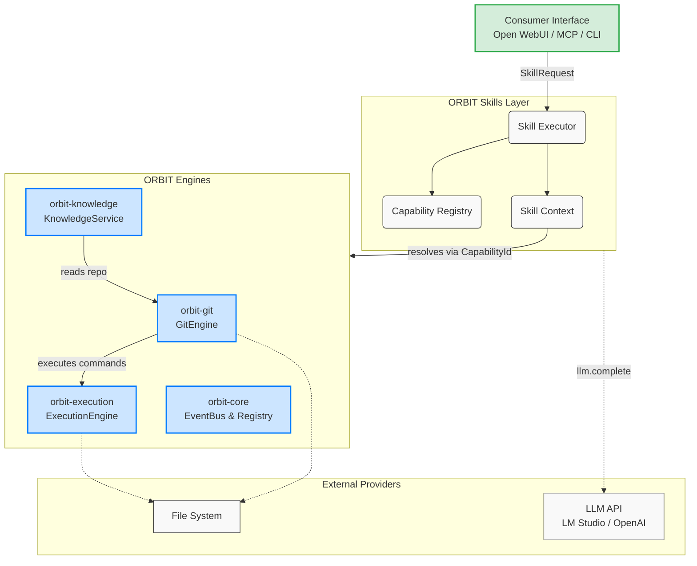

# ORBIT

## What is ORBIT?

ORBIT is a modular, high-performance orchestration platform designed for autonomous AI agents. Built entirely on standard libraries and zero-dependency principles (outside of specialized adapters), ORBIT provides a highly decoupled foundation encompassing safe execution (`orbit-execution`), robust event-driven Git integration (`orbit-git`), knowledge extraction (`orbit-knowledge`), and a high-level capability-based orchestration layer (`orbit-skills`).

ORBIT acts as the bridging infrastructure between language models, the local filesystem, terminal execution, and external systems, designed to be exposed to consumers like Open WebUI, MCP, and CLI interfaces.

## Architecture

ORBIT is designed as a directed acyclic graph (DAG) of engines, orchestrated by the `orbit-skills` layer.

## Requirements

To run ORBIT natively, you need:

- **Python:** 3.10 or higher.
- **Package Manager:** [`uv`](https://github.com/astral-sh/uv) (Extremely fast Python package installer and resolver).
- **Git:** 2.30 or higher.
- **LLM Provider:** A local inference server like [LM Studio](https://lmstudio.ai/) exposing an OpenAI-compatible API on `http://localhost:1234/v1`.

## Installation

ORBIT is designed to be fully bootstrapped in seconds using `uv`. 

For complete installation steps, please see [INSTALL.md](INSTALL.md).

## First Use

Want to get started immediately? Head over to [QUICKSTART.md](QUICKSTART.md) to go from an empty terminal to summarizing a local git repository in less than 5 minutes using the ORBIT Skills engine.

## Roadmap

- **Milestone 1:** End-to-End Core Integration (Git + Knowledge + LLM via Skills). **(Current)**
- **Milestone 2:** Abstract syntax tree parsing (AST) and dynamic code mapping in `orbit-knowledge`.
- **Milestone 3:** Full Model Context Protocol (MCP) server implementation exposing ORBIT Skills.
- **Milestone 4:** Agentic Loops (Autonomous loop integration with task-planning capabilities).

## Contribution

ORBIT enforces strict zero-dependency architectural rules:
- `orbit-core`, `orbit-git`, and `orbit-execution` must **never** depend on non-standard libraries (except for specific, isolated adapters like YAML parsers).
- `orbit-skills` relies exclusively on `dataclasses(frozen=True)`. Do not introduce Pydantic.
- No direct `subprocess` calls in any engine outside of `orbit-execution`.

All code is checked via `ruff`, `mypy`, and `pytest`. See our contributor scripts in the `scripts/` directory to run the validation suite locally.