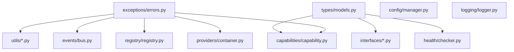

# Dependency Graph

```mermaid
graph TD
    %% Types and Interfaces (Bottom layer)
    Exceptions[exceptions/errors.py]
    Types[types/models.py]
    Interfaces[interfaces/*.py]
    
    %% Utilities
    Utils[utils/*.py]
    Exceptions --> Utils
    
    %% Core Infrastructure
    Config[config/manager.py]
    Logging[logging/logger.py]
    Events[events/bus.py]
    Health[health/checker.py]
    Registry[registry/registry.py]
    DI[providers/container.py]
    Capabilities[capabilities/capability.py]
    
    %% Relationships
    Types --> Interfaces
    Types --> Health
    Types --> Capabilities
    
    Exceptions --> Events
    Exceptions --> Registry
    Exceptions --> DI
    Exceptions --> Capabilities
```
