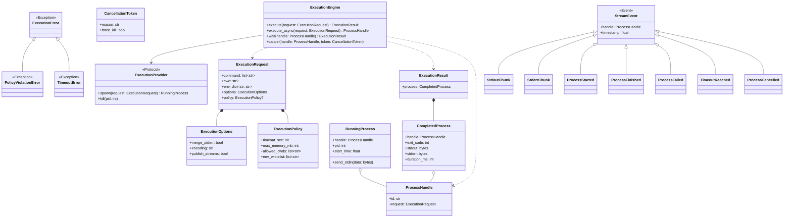

# ORBIT Execution: Class Diagram

```mermaid
classDiagram
    class ExecutionEngine {
        +execute(request: ExecutionRequest) ExecutionResult
        +execute_async(request: ExecutionRequest) ProcessHandle
        +wait(handle: ProcessHandle) ExecutionResult
        +cancel(handle: ProcessHandle, token: CancellationToken)
    }

    class ExecutionProvider {
        <<Protocol>>
        +spawn(request: ExecutionRequest) RunningProcess
        +kill(pid: int)
    }
    
    class ExecutionRequest {
        +command: list~str~
        +cwd: str?
        +env: dict~str, str~
        +options: ExecutionOptions
        +policy: ExecutionPolicy?
    }

    class ExecutionOptions {
        +merge_stderr: bool
        +encoding: str
        +publish_streams: bool
    }

    class ExecutionPolicy {
        +timeout_sec: int
        +max_memory_mb: int
        +allowed_cwds: list~str~
        +env_whitelist: list~str~
    }

    class ProcessHandle {
        +id: str
        +request: ExecutionRequest
    }

    class RunningProcess {
        +handle: ProcessHandle
        +pid: int
        +start_time: float
        +send_stdin(data: bytes)
    }

    class CompletedProcess {
        +handle: ProcessHandle
        +exit_code: int
        +stdout: bytes
        +stderr: bytes
        +duration_ms: int
    }

    class ExecutionResult {
        +process: CompletedProcess
    }

    class CancellationToken {
        +reason: str
        +force_kill: bool
    }

    %% Exceptions
    class ExecutionError {
        <<Exception>>
    }
    class PolicyViolationError {
        <<Exception>>
    }
    class TimeoutError {
        <<Exception>>
    }
    
    ExecutionError <|-- PolicyViolationError
    ExecutionError <|-- TimeoutError

    %% Streaming Events
    class StreamEvent {
        <<Event>>
        +handle: ProcessHandle
        +timestamp: float
    }
    
    class StdoutChunk
    class StderrChunk
    class ProcessStarted
    class ProcessFinished
    class ProcessFailed
    class TimeoutReached
    class ProcessCancelled

    StreamEvent <|-- StdoutChunk
    StreamEvent <|-- StderrChunk
    StreamEvent <|-- ProcessStarted
    StreamEvent <|-- ProcessFinished
    StreamEvent <|-- ProcessFailed
    StreamEvent <|-- TimeoutReached
    StreamEvent <|-- ProcessCancelled

    %% Relationships
    ExecutionEngine --> ExecutionProvider
    ExecutionEngine ..> ExecutionRequest
    ExecutionEngine ..> ExecutionResult
    ExecutionEngine ..> ProcessHandle
    
    ExecutionRequest *-- ExecutionOptions
    ExecutionRequest *-- ExecutionPolicy
    
    RunningProcess o-- ProcessHandle
    CompletedProcess o-- ProcessHandle
    ExecutionResult *-- CompletedProcess
```
