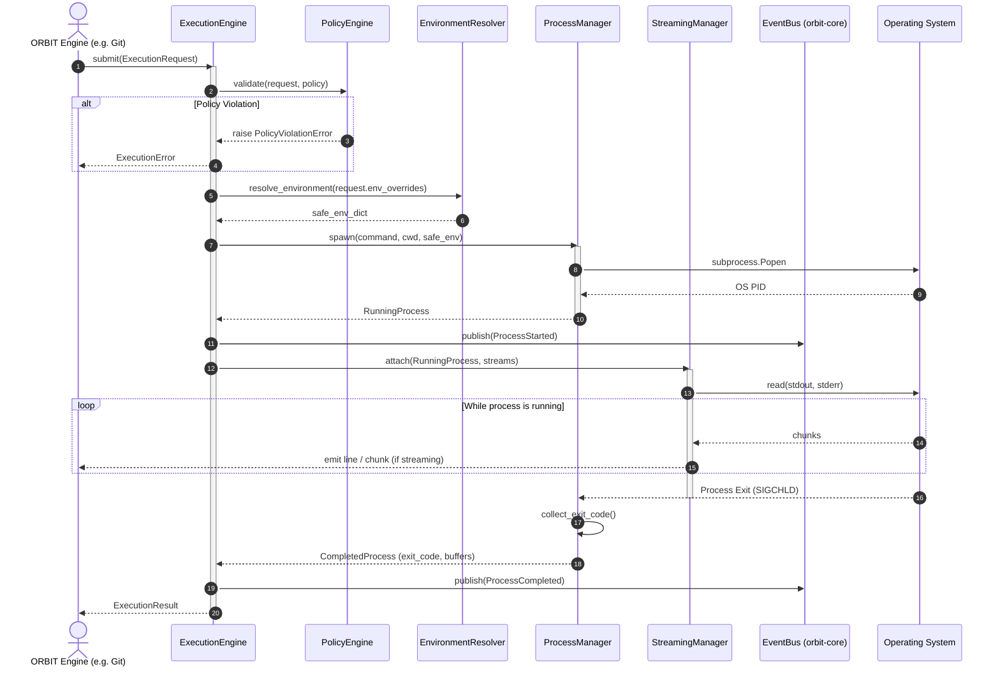

# ORBIT Execution: Execution Flow Sequence

This sequence diagram illustrates the lifecycle of a process execution request through the ORBIT Execution Engine.

```mermaid
sequenceDiagram
    autonumber
    
    actor Caller as ORBIT Engine (e.g. Git)
    participant Exec as ExecutionEngine
    participant Policy as PolicyEngine
    participant Env as EnvironmentResolver
    participant ProcessManager
    participant Streams as StreamingManager
    participant Bus as EventBus (orbit-core)
    participant OS as Operating System
    
    Caller->>Exec: submit(ExecutionRequest)
    
    activate Exec
    Exec->>Policy: validate(request, policy)
    alt Policy Violation
        Policy-->>Exec: raise PolicyViolationError
        Exec-->>Caller: ExecutionError
    end
    
    Exec->>Env: resolve_environment(request.env_overrides)
    Env-->>Exec: safe_env_dict
    
    Exec->>ProcessManager: spawn(command, cwd, safe_env)
    activate ProcessManager
    ProcessManager->>OS: subprocess.Popen
    OS-->>ProcessManager: OS PID
    
    ProcessManager-->>Exec: RunningProcess
    deactivate ProcessManager
    
    Exec->>Bus: publish(ProcessStarted)
    
    Exec->>Streams: attach(RunningProcess, streams)
    activate Streams
    Streams->>OS: read(stdout, stderr)
    
    loop While process is running
        OS-->>Streams: chunks
        Streams-->>Caller: emit line / chunk (if streaming)
    end
    
    OS-->>ProcessManager: Process Exit (SIGCHLD)
    deactivate Streams
    
    ProcessManager->>ProcessManager: collect_exit_code()
    ProcessManager-->>Exec: CompletedProcess (exit_code, buffers)
    
    Exec->>Bus: publish(ProcessCompleted)
    Exec-->>Caller: ExecutionResult
    deactivate Exec
```
