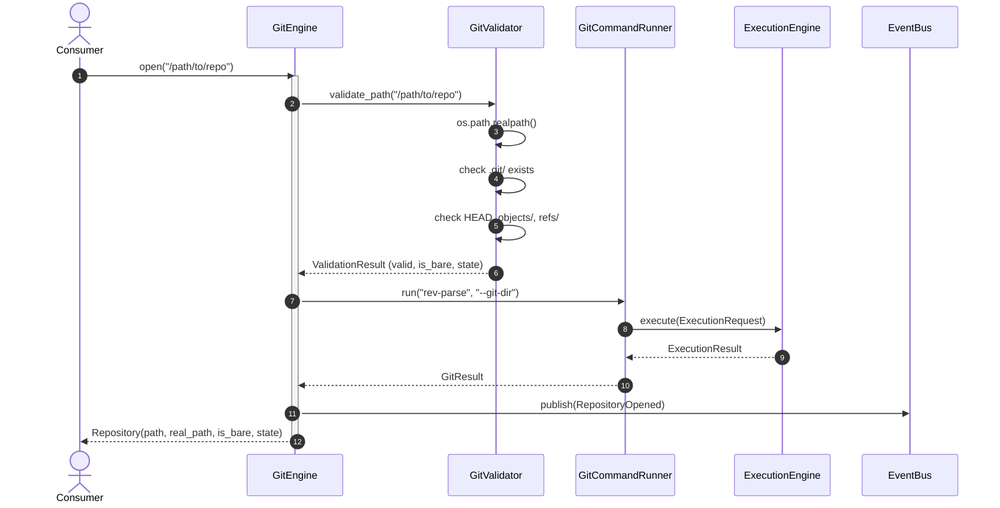
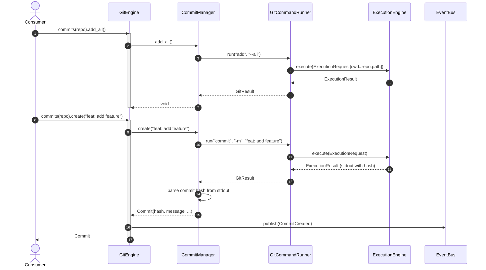
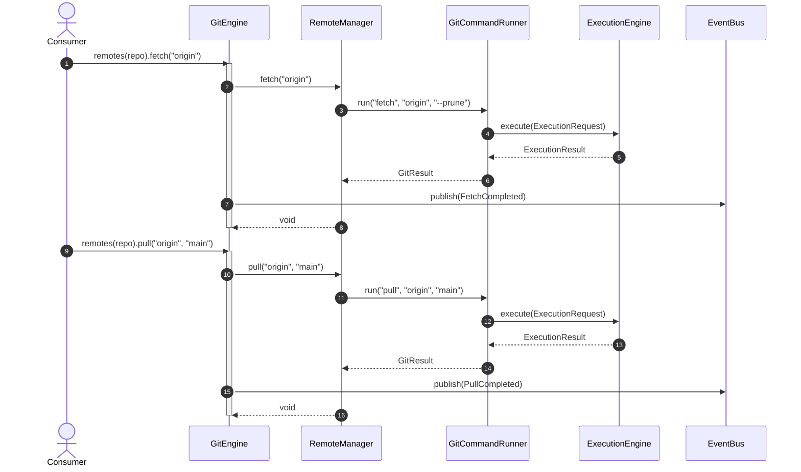
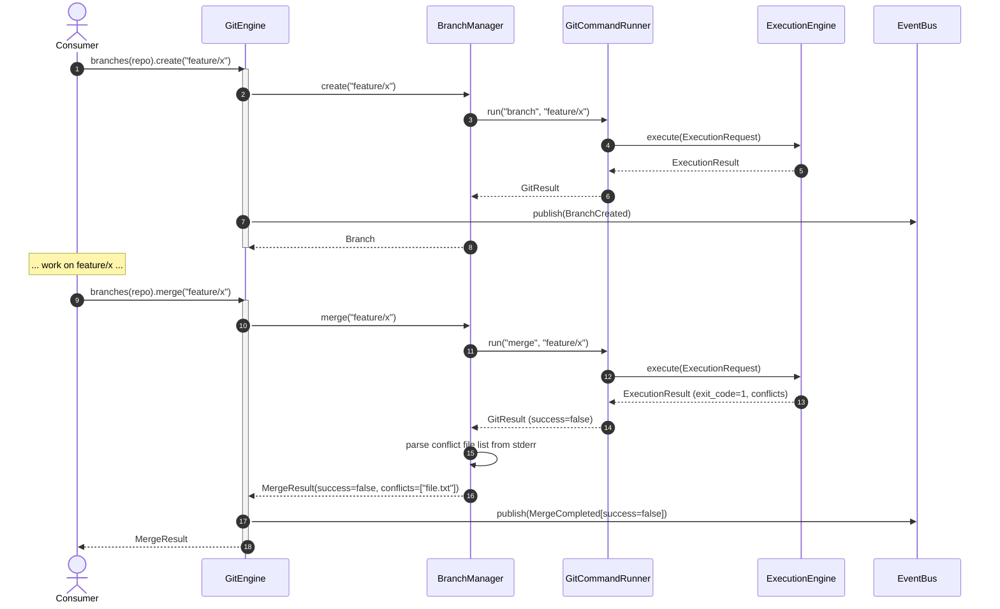
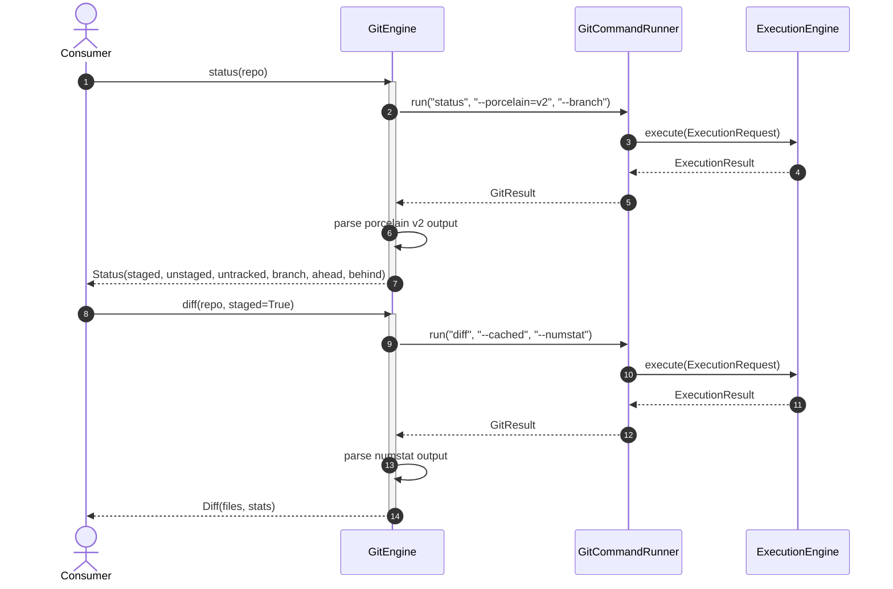
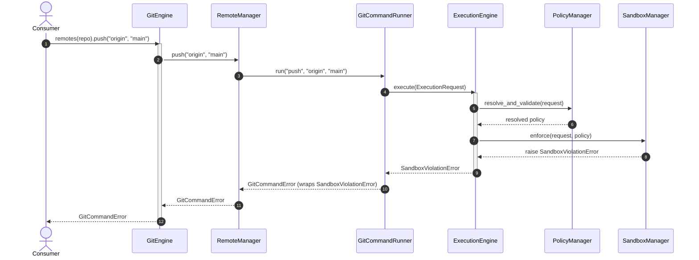

# ORBIT Git: Sequence Diagrams

This document illustrates the key execution flows through the ORBIT Git architecture.

---

## 1. Open Repository

---

## 2. Commit Workflow (add + commit)

---

## 3. Fetch + Pull

---

## 4. Branch + Merge with Conflict

---

## 5. Status + Diff

---

## 6. Push with Policy Rejection

