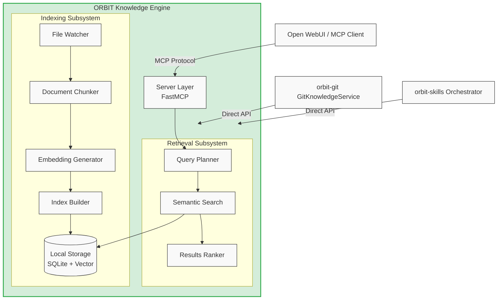

# Component Diagram — ORBIT Knowledge

```mermaid
graph TD
    %% External Consumers
    WebUI[Open WebUI / MCP Client]
    GitAdapter[orbit-git GitKnowledgeService]
    Skills[orbit-skills Orchestrator]

    %% ORBIT Knowledge Core
    subgraph ORBIT_Knowledge [ORBIT Knowledge Engine]
        Server[Server Layer<br/>FastMCP]
        
        subgraph Indexing [Indexing Subsystem]
            Watcher[File Watcher]
            Chunker[Document Chunker]
            Embedder[Embedding Generator]
            Builder[Index Builder]
            Storage[(Local Storage<br/>SQLite + Vector)]
        end
        
        subgraph Retrieval [Retrieval Subsystem]
            Planner[Query Planner]
            Semantic[Semantic Search]
            Ranker[Results Ranker]
        end
        
        %% Internal Wiring
        Server --> Planner
        Planner --> Semantic
        Semantic --> Storage
        Semantic --> Ranker
        
        Watcher --> Chunker
        Chunker --> Embedder
        Embedder --> Builder
        Builder --> Storage
    end

    %% Wiring
    WebUI -->|MCP Protocol| Server
    GitAdapter -->|Direct API| Retrieval
    Skills -->|Direct API| Retrieval
    
    classDef default fill:#f9f9f9,stroke:#333,stroke-width:1px;
    classDef component fill:#d4edda,stroke:#28a745,stroke-width:2px;
    
    class ORBIT_Knowledge component;
```
