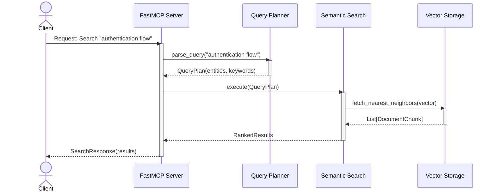

# Sequence Diagram — ORBIT Knowledge

## Semantic Search Flow

```mermaid
sequenceDiagram
    actor Client
    participant Server as FastMCP Server
    participant Planner as Query Planner
    participant Search as Semantic Search
    participant Storage as Vector Storage
    
    Client->>Server: Request: Search "authentication flow"
    activate Server
    
    Server->>Planner: parse_query("authentication flow")
    activate Planner
    Planner-->>Server: QueryPlan(entities, keywords)
    deactivate Planner
    
    Server->>Search: execute(QueryPlan)
    activate Search
    
    Search->>Storage: fetch_nearest_neighbors(vector)
    activate Storage
    Storage-->>Search: List[DocumentChunk]
    deactivate Storage
    
    Search-->>Server: RankedResults
    deactivate Search
    
    Server-->>Client: SearchResponse(results)
    deactivate Server
```
