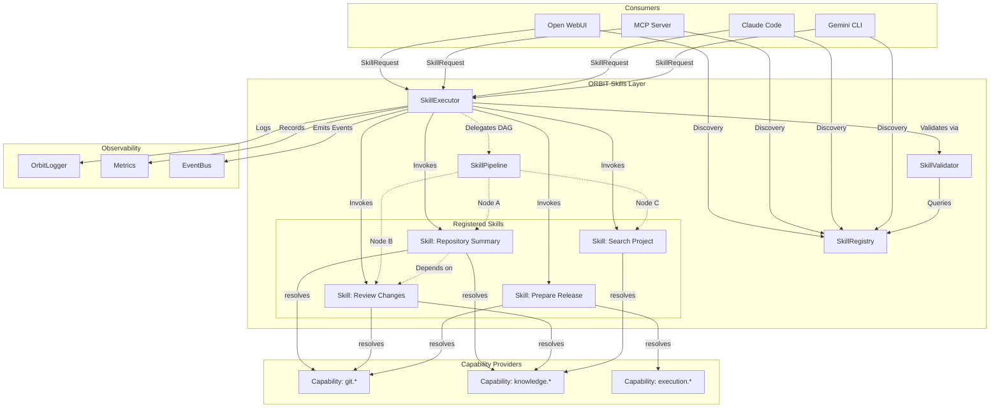

# Component Diagram: ORBIT Skills

```mermaid
graph TD
    %% Consumers
    subgraph Consumers
        OW[Open WebUI]
        MCP[MCP Server]
        CC[Claude Code]
        GC[Gemini CLI]
    end

    %% Skills Layer
    subgraph "ORBIT Skills Layer"
        SR[SkillRegistry]
        SE[SkillExecutor]
        SP[SkillPipeline]
        SV[SkillValidator]
        
        %% Individual Skills
        subgraph "Registered Skills"
            S1[Skill: Repository Summary]
            S2[Skill: Review Changes]
            S3[Skill: Prepare Release]
            S4[Skill: Search Project]
        end
    end

    %% Capability Resolvers
    subgraph "Capability Providers"
        CapG[Capability: git.*]
        CapK[Capability: knowledge.*]
        CapE[Capability: execution.*]
    end

    %% Observability Layer
    subgraph Observability
        Log[OrbitLogger]
        Met[Metrics]
        Bus[EventBus]
    end

    %% Consumer Interactions
    OW -->|Discovery| SR
    MCP -->|Discovery| SR
    CC -->|Discovery| SR
    GC -->|Discovery| SR

    OW -->|SkillRequest| SE
    MCP -->|SkillRequest| SE
    CC -->|SkillRequest| SE
    GC -->|SkillRequest| SE

    %% Executor workflow
    SE -->|Validates via| SV
    SV -->|Queries| SR
    SE -->|Invokes| S1
    SE -->|Invokes| S2
    SE -->|Invokes| S3
    SE -->|Invokes| S4
    
    %% Pipeline interactions (DAG)
    SE -.->|Delegates DAG| SP
    SP -.->|Node A| S1
    SP -.->|Node B| S2
    SP -.->|Node C| S4
    S1 -.->|Depends on| S2

    %% Capability Resolution
    S1 -->|resolves| CapG
    S1 -->|resolves| CapK
    
    S2 -->|resolves| CapG
    S2 -->|resolves| CapK
    
    S3 -->|resolves| CapG
    S3 -->|resolves| CapE
    
    S4 -->|resolves| CapK

    %% Observability Wiring
    SE -->|Emits Events| Bus
    SE -->|Records| Met
    SE -->|Logs| Log
```
