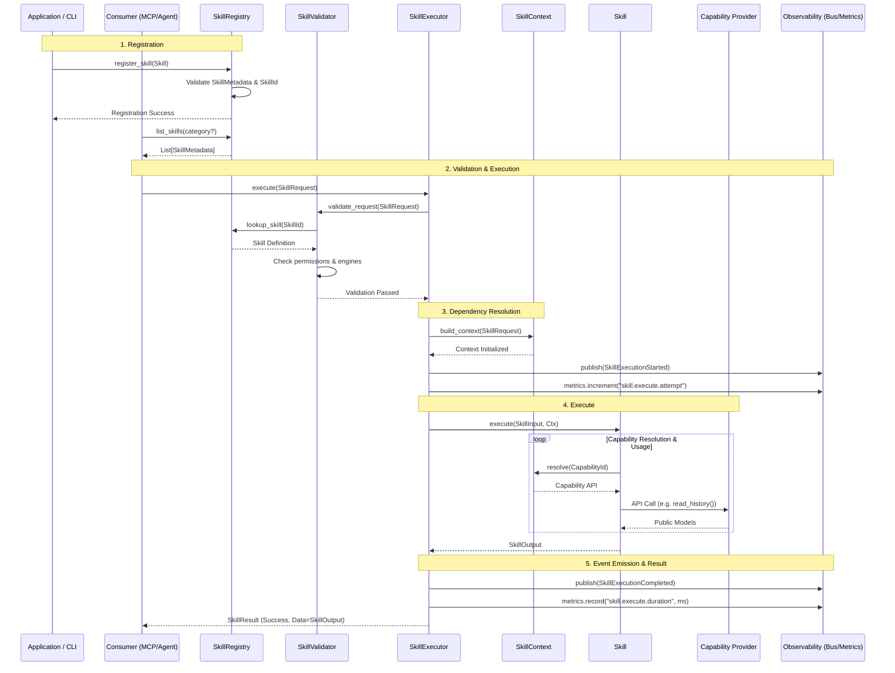

# Sequence Diagram: ORBIT Skills Lifecycle

This sequence diagram illustrates the lifecycle of a Skill from Registration through Execution.

```mermaid
sequenceDiagram
    participant App as Application / CLI
    participant Cons as Consumer (MCP/Agent)
    participant Reg as SkillRegistry
    participant Val as SkillValidator
    participant Exec as SkillExecutor
    participant Ctx as SkillContext
    participant Skill as Skill
    participant Cap as Capability Provider
    participant Obs as Observability (Bus/Metrics)

    %% Registration Phase
    Note over App,Reg: 1. Registration
    App->>Reg: register_skill(Skill)
    Reg->>Reg: Validate SkillMetadata & SkillId
    Reg-->>App: Registration Success

    %% Discovery
    Cons->>Reg: list_skills(category?)
    Reg-->>Cons: List[SkillMetadata]

    %% Execution Phase
    Note over Cons,Obs: 2. Validation & Execution
    Cons->>Exec: execute(SkillRequest)
    
    Exec->>Val: validate_request(SkillRequest)
    Val->>Reg: lookup_skill(SkillId)
    Reg-->>Val: Skill Definition
    Val->>Val: Check permissions & engines
    Val-->>Exec: Validation Passed

    %% Context Provisioning
    Note over Exec,Ctx: 3. Dependency Resolution
    Exec->>Ctx: build_context(SkillRequest)
    Ctx-->>Exec: Context Initialized
    
    Exec->>Obs: publish(SkillExecutionStarted)
    Exec->>Obs: metrics.increment("skill.execute.attempt")

    %% Execution
    Note over Exec,Cap: 4. Execute
    Exec->>Skill: execute(SkillInput, Ctx)
    
    loop Capability Resolution & Usage
        Skill->>Ctx: resolve(CapabilityId)
        Ctx-->>Skill: Capability API
        Skill->>Cap: API Call (e.g. read_history())
        Cap-->>Skill: Public Models
    end

    Skill-->>Exec: SkillOutput

    %% Finalization
    Note over Exec,Obs: 5. Event Emission & Result
    Exec->>Obs: publish(SkillExecutionCompleted)
    Exec->>Obs: metrics.record("skill.execute.duration", ms)

    Exec-->>Cons: SkillResult (Success, Data=SkillOutput)
```
